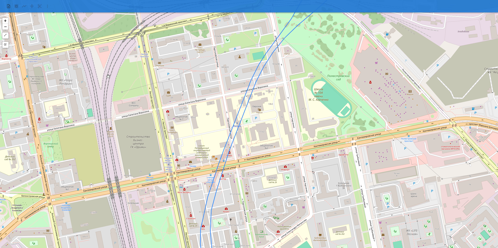

# GeoJSON Map Viewer
Этот проект представляет собой веб-приложение на React.js, которое позволяет пользователям загружать и визуализировать файлы GeoJSON, взаимодействовать с географическими данными и выполнять различные операции с объектами на карте. Приложение предоставляет инструменты для рисования новых линий, выбора и объединения объектов карты и многое другое.

## Содержание

- [Функциональность](#функциональность)
- [Установка и настройка](#установка-и-настройка)
  - [Требования](#требования)
  - [Установка](#установка)
  - [Запуск приложения](#запуск-приложения)
- [Инструкция по использованию](#инструкция-по-использованию)
  - [Загрузить файл GeoJSON](#загрузить-файл-geojson)
  - [Войти/Выйти из режима выбора](#войтивыйти-из-режима-выбора)
  - [Создать линии и полигон](#создать-линии-и-полигон)
  - [Упростить выбранный LineString](#упростить-выбранный-linestring)
  - [Разбить выбранный LineString](#разбить-выбранный-linestring)
  - [Параметры отладки](#параметры-отладки)
  - [Нарисовать линию](#нарисовать-линию)
  - [Режим редактирования](#Включить-режим-редактирования)
- [Дополнительная информация и известные проблемы](#дополнительная-информация)

## Функциональность

- **Загрузка файлов GeoJSON**: Загружайте файлы GeoJSON и визуализируйте полигоны, линии и точки на карте. Поддерживает загрузку из карт OpenStreetMap + конвертирует к стандарту Wgs84 другие карты
- **Рисование новых линий**: Используйте инструменты рисования для создания новых линий.
- **Режим выбора**: Выбирайте объекты на карте, кликая по ним, чтобы выполнять различные операции.
- **Объединение объектов**: Объединяйте выбранные объекты в один полигон.
- **Упрощение линий**: Сокращайте сложность линии, упрощая ее геометрию.
- **Разбиение линий**: Разбивайте выбранную линию на сегменты равной длины.

## Установка и настройка

### Требования

- **Node.js**: Версия 14 или выше. Вы можете загрузить его с [официального сайта](https://nodejs.org/).
- **npm**: Поставляется вместе с Node.js.

### Установка

Склонируйте репозиторий или загрузите исходный код на ваш локальный компьютер.

### Запуск приложения

Вы можете запустить приложение с помощью предоставленных скриптов для "сборки в один клик".

#### Для Unix-систем (Linux/macOS):

1. Откройте терминал в корневой директории проекта.
2. Сделайте скрипт `start.sh` исполняемым:

   ```bash
   chmod +x start.sh
   ```

3. Запустите скрипт:

   ```bash
   ./start.sh
   ```

#### Для Windows:

1. Дважды щелкните по файлу `start.bat` в корневой директории проекта.
   - Альтернативно, откройте командную строку в корневой директории проекта и выполните:

     ```cmd
     start.bat
     ```

Приложение установит все необходимые зависимости и запустит сервер разработки. После запуска вы можете открыть приложение в веб-браузере по адресу `http://localhost:3000`.

## Инструкция по использованию

### Кнопки на панели инструментов

Панель инструментов приложения предоставляет несколько кнопок для взаимодействия с объектами карты. Ниже приводится подробное описание каждой кнопки и ее поведения.

## Описание кнопок

### Загрузить файл GeoJSON

- **Иконка**: 
- **Описание**: Открывает меню для загрузки файла GeoJSON.
- **Опции**:
  - **Upload from OSM**: Загрузить файл GeoJSON из OpenStreetMap без преобразования координат. Поддерживает географическую карту в виде бэкграунда.
  - **Upload from Parser**: Загрузить файл GeoJSON и преобразовать его координаты в WGS84.
- **Поведение**:
  - После выбора файла карта отображает объекты из GeoJSON.
  - Карта центрируется, чтобы охватить границы загруженных данных.
  - Дублирующиеся линии автоматически удаляются (Является проблемой в некоторых картах из OSM)

### Войти/Выйти из режима выбора

- **Иконка**: 
- **Описание**: Переключает режим выбора объектов на карте. Другие кнопки панели инструментов (кроме загрузки) неактивны, пока не включен режим выбора.
- **Поведение**:
  - **Вход в режим выбора**:
    - Кнопка изменяет внешний вид, чтобы показать, что режим выбора активен.
    - Кликните по объектам на карте, чтобы выбрать их (они подсветятся красным цветом).
  - **Выход из режима выбора**:
    - Кнопка возвращается к обычному виду.
    - Выделенные объекты сбрасываются.

### Создать линии и полигон

- **Иконка**: 
- **Описание**: Соединяет выбранные линии и создает полигон.
- **Поведение**:
  - Требуется выбрать по крайней мере две линии.
  - Автоматически создает соединительные линии между концами выбранных линий.
  - Объединяет линии в один полигон.
  - Соединительные линии удаляются.

- **Примечания**:
  - Сейчас логика работы следующая: Линии, у которых есть общие точки начала/конца - объединяются в одну линию. После этого для каждой точки начала/конца линии выполняется поиск ближайшей точки начала/конца другой линии и точки соединяются в линию.
  - Это не оптимальный алгоритм. Хоть он и работает в "обычных случаях" - есть какое-то количество уникальных кейсов, когда такой подход не будет работать правильно (например, если какая-то линия будет полностью выше другой).
  - Сейчас я предполагаю, что эту проблему можно будет решить постройкой матрицы координат и использованием венгерского алгоритма, но пока попытки использовать его - не увенчались успехом.

### Упростить выбранный LineString

- **Иконка**: 
- **Описание**: Упрощает геометрию выбранной линии, уменьшая ее сложность.
- **Поведение**:
  - Требуется выбрать одну линию.
  - Уменьшает количество точек в линии на основе заданной величины упрощения.
  - Заменяет оригинальную линию упрощенной версией.
  - Упрощенные сегменты отображаются синим цветом.

- **Примечания**:
  - Сейчас изменить величину упрощения можно только через код. В будущем можно добавить возможность задать её через приложение и высчитывать какое-то стандартное значение для карт разных систем координат

### Разбить выбранный LineString

- **Иконка**: 
- **Описание**: Разбивает выбранную линию на сегменты равной длины.
- **Поведение**:
  - Требуется выбрать одну линию.
  - Разбивает линию на сегменты заданной длины (в радианах).
  - Новые сегменты добавляются на карту.
  
- **Примечания**:
  - Сейчас изменить величину и юниты разбиения можно только через код. В будущем можно добавить возможность менять это через приложение и высчитывать какое-то стандартное значение для карт разных систем координат

### Параметры отладки

- **Иконка**: 
- **Описание**: Открывает меню с дополнительными действиями для отладки.
- **Опции**:
  - **Clear GeoJSON Data**: Удаляет все объекты с карты.
  - **Create Connecting Lines**: Создает линии, соединяющие концы выбранных линий.
  - **Create Polygon from Lines**: Пытается создать полигон из выбранных линий.
- **Поведение**:
  - Эти опции предназначены в основном для тестирования и отладки. На них строится работа кнопки создания линий и полигонов.

### Кнопки на карте
## Описание кнопок

### Нарисовать линию

- **Иконка**: 
- **Описание**: Позволяет нарисовать линию на карте по точкам. Поддерживает создание линии из нескольких точек.

### Включить режим редактирования
- **Иконка**: 
- **Описание**: Позволяет менять каждую линию и полигон, перетягивая его части.
- **Примечания**:
  - Сейчас используется для дебага. Позволяет подвинуть объекты и посмотреть, что находится за ними.
  - При попытке сохранить отредактированный объект сломает объекты на карте, или склонирует отредактированный объект несколько раз.
  - Попытки выяснить "что не так" продолжаются.

## Дополнительная информация

- **Зависимости**:
  - React и React DOM
  - React Leaflet и Leaflet
  - Leaflet Draw для инструментов рисования
  - Turf.js для пространственного анализа
  - Material-UI для компонентов пользовательского интерфейса

- **Известные проблемы**:
  - Большие файлы GeoJSON могут влиять на производительность.
  - В определенных случаях соединение линий может отрабатывать неправильно. См. [Создание линии](#Создать-линии-и-полигон)
  - При попытке сохранить редактируемый объект - какие-то объекты могут пропасть, а какие-то продублироваться. См. [Режим редактирования](#Включить-режим-редактирования)
  - Из-за работы компонента редактирования сейчас основная логика нагромождена в App.js. При попытке перенести её в другое место - редактирование перестает работать вообще.
  - После нескольких загрузок файла в одной сессии ломается центрирование. Проблема опять упирается в компонент, связанный с редактированием.

---

*Примечание: Если у вас возникнут какие-либо проблемы или вопросы, пожалуйста, свяжитесь со мной или создайте проблему в репозитории.*